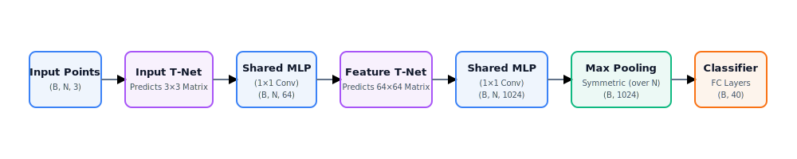
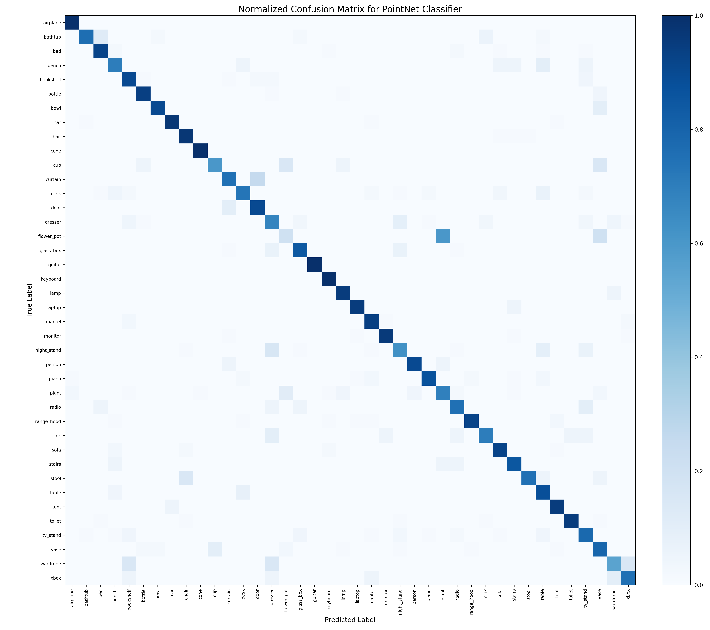

# PointNet-PyTorch

<p align="center">
  
  
  
  
  
</p>

A modular PyTorch reimplementation of PointNet (CVPR 2017), built entirely from scratch for 3D point cloud classification on ModelNet40.

The project reproduces the original architecture—including both T-Nets, shared MLPs, symmetric max pooling, and orthogonal regularization—and serves as the geometric deep learning foundation for Spatialize.

---

## PointNet Architecture

<p align="center">
  
</p>

<p align="center">
  <em>A high-level overview of the PointNet classification pipeline.</em>
</p>

---

## Overview

- ✔ **Built from scratch** in PyTorch with no external PointNet libraries

- ✔ **Dual T-Nets**: Fully implements both Input T-Net (3x3) and Feature T-Net (64x64)

- ✔ **ModelNet40 support**: End-to-end data loaders, sampling, and data augmentation

- ✔ **Production-grade**: Complete unit tests, training pipelines, and evaluation metrics (confusion matrix, per-class reports)

- ✔ **Spatialize foundation**: Serves as the geometric deep learning backbone for text-to-3D spatial reasoning

---

## Highlights

- **Pure PyTorch implementation** from first principles

- **From-scratch T-Nets** with identity initialization for pose & feature alignment

- **Orthogonal regularization** for high-dimensional feature transform stability

- **Point cloud augmentation** (random Y-axis rotation and Gaussian jitter)

- **Unit-tested architectures** validating exact output shapes and properties

- **Reproducible experiments** with training logs, per-class accuracies, and confusion matrix plots

---

## Results & Training Configuration

### Training Configuration

| Parameter | Value |
|---|---|
| Input Points | 1024 |
| Batch Size | 32 |
| Optimizer | Adam |
| Learning Rate (LR) | 0.001 |
| LR Scheduler | StepLR (decay step = 20, gamma = 0.5) |
| Loss Function | CrossEntropy + 0.001 * OrthoRegLoss |
| Data Augmentation | Random rotation (Y-axis), Gaussian jitter |

### Evaluation Metrics

| Metric | Value |
|---|---|
| Overall Test Accuracy | **86.43%** |
| Average Class Accuracy | **82.96%** |
| Total Parameters | **3.48M** |
| Epochs Trained | 100 |
| Training Time | ~36 minutes (Colab T4 GPU) |
| Best-performing classes | airplane, cone, guitar, keyboard (100.00%) |
| Hardest classes | flower_pot (20.00%), wardrobe (55.00%), cup (60.00%) |

### Confusion Matrix



- **Overall Test Accuracy (86.43%)**: Strong diagonal dominance shows correct classification for the majority of shapes.
- **Perfect Classes (100.00%)**: Geometrically distinct objects like `airplane`, `cone`, `guitar`, and `keyboard` achieved perfect accuracy.
- **Inter-class Confusions**: Similar geometries caused errors, notably `flower_pot` (20.00%) confused with `plant`/`vase`, `wardrobe`/`night_stand` with boxy furniture, and `cup` with `bowl`/`vase`.

---

## Why this project exists

This implementation serves as the geometric backbone for Spatialize.

Spatialize transforms natural language into structured 3D environments. Understanding unordered 3D point sets is one of the fundamental capabilities required before progressing toward scene generation, spatial reasoning, and point-cloud based representations.

---

## Mathematical Background

PointNet approximates any continuous set function $f(S)$ on a point set $S = \{x_1, \dots, x_n\}$ using a symmetric aggregation function:

$$f(S) \approx \gamma \left( \max_{i=1, \dots, n} \{ h(x_i) \} \right)$$

Where:
- $h: \mathbb{R}^3 \to \mathbb{R}^d$ is approximated by shared Multi-Layer Perceptrons (MLPs).
- $\max$ is the element-wise symmetric max-pooling function, ensuring **permutation invariance** (the output is invariant to point order).
- $\gamma$ represents the fully connected classifier network mapping the global descriptor to output class scores.

---

## Architecture Details

- **Shared MLPs (Independent Point Projection)**: Instead of processing the point cloud as a tensor with spatial convolutions, every point is independently projected into a higher-dimensional feature space using shared weights. They are implemented as 1×1 `Conv1d` layers because a 1×1 convolution over the point dimension is mathematically equivalent to applying the same fully connected layer independently to every point, which allows for highly efficient, batched GPU computations.

- **T-Nets (Spatial Transformer Networks)**: Small sub-networks that predict a transformation matrix from the input data itself, aligning the points to a canonical pose. They are initialized to predict the identity matrix so training starts stable.

- **Symmetric Max Pooling**: Aggregates features across all points into a single global shape descriptor. This symmetric operation makes the network completely invariant to input point order.

- **Orthogonal Regularization**: A regularization term ($L_{reg} = \|I - AA^T\|_F^2$) is added to the loss to keep the 64x64 feature transform matrix $A$ close to orthogonal, preventing high-dimensional feature distortion.

---

## Experiments (Ablations)

To understand why each component of PointNet matters, not just implement it:

| Variant | Test Accuracy |
|---|---|
| Full model | 86.43% |
| Without input T-Net | [FILL IN] |
| Without feature T-Net | [FILL IN] |
| Average pooling instead of max pooling | [FILL IN] |
| Without data augmentation | [FILL IN] |
| Without orthogonal regularization | [FILL IN] |

---

## Lessons Learned

- **Permutation Invariance is Core**: Point clouds are unordered sets. Using symmetric aggregation (max pooling) is mathematically necessary because it forces the function to be invariant to the 1024! possible orderings of input points.

- **T-Net Identity Initialization is Crucial**: Without initializing T-Net fully connected biases to predict the identity matrix, early training steps predict random transformations, leading to immediate divergence.

- **Orthogonal Regularization Stabilizes Alignment**: The 64x64 feature transform matrix has a high degree of freedom; constraining it to be orthogonal prevents it from collapsing/distorting the projected features.

- **Local Geometry Limitation**: PointNet processes points independently before max pooling, meaning it fails to capture local neighborhood structures (a limitation that later motivated PointNet++).

---

## Limitations & Future Work

### Limitations

- **Classification Only**: The current pipeline is built exclusively for global classification; it does not include a segmentation head.

- **No PointNet++ Local Features**: It lacks the hierarchical grouping (Set Abstraction levels) introduced in PointNet++.

- **No Normal Vectors**: The model consumes raw `(x, y, z)` coordinates only, without normal vector inputs (`nx, ny, nz`).

- **No Feature Visualization**: T-Net transformation matrices and critical points are not dynamically plotted.

### Future Work

- **PointNet++**: Extend the architecture with set abstraction layers for hierarchical feature learning.

- **Part Segmentation**: Implement a segmentation head for dense shape part labeling.

- **DGCNN / Point Transformer**: Incorporate graph neural networks or self-attention to model local relationships.

- **ScanObjectNN Support**: Benchmark robustness on real-world scanned, noisy, and occluded point clouds.

---

## Project Structure

```
pointnet-pytorch/
├── data/                  # ModelNet40 (downloaded, not committed)
├── models/
│   └── pointnet.py        # T-Net + PointNetClassifier
├── dataset.py              # ModelNet40 loading, sampling, augmentation
├── train.py                 # training loop
├── evaluate.py               # evaluation + per-class accuracy + confusion matrix
├── utils.py                   # regularization loss, helpers
├── config.py                   # hyperparameters
└── tests/                       # shape/sanity tests for T-Net and model
```

## How to Run

**Setup**
```bash
git clone https://github.com/mariiammaysara/PointNet-PyTorch.git
cd PointNet-PyTorch
pip install -r requirements.txt
```

**Training (recommended: Colab, GPU)**
```python
!git clone https://github.com/mariiammaysara/PointNet-PyTorch.git
%cd PointNet-PyTorch
!pip install -r requirements.txt
!python train.py --epochs 100 --batch_size 32
```

**Evaluation**
```bash
python evaluate.py
```

## Implementation Notes & Known Issues

- **Identity initialization in T-Net**: the last FC layer's weights are zeroed and its bias set to the flattened identity matrix, so both T-Nets start out predicting "no transformation." Without this, training is noticeably less stable early on.
- **Regularization weight**: the feature transform regularization term is scaled by `0.001` per the paper — too high and it dominates the classification loss, too low and the 64×64 transform can drift.
- **Data augmentation**: random rotation around the Y-axis (up-axis) plus small Gaussian jitter, applied only at training time.
- **Bugs I hit and fixed**:
  - **Stanford Dataset Server Connection Timeout**: Stanford's official server (`shapenet.cs.stanford.edu`) frequently timed out or rejected connections from Google Colab. Resolved by downloading ModelNet40 from a Hugging Face mirror.
  - **Nested Pathing in Colab**: Repeated execution of `%cd` cells in Jupyter/Colab notebooks caused working directories to nest incorrectly. Fixed by keeping path navigation cell execution controlled and explicit.
  - **BatchNorm1d single-sample failure**: `BatchNorm1d` fails during training if the last batch contains exactly 1 sample (due to variance calculation constraints). Resolved by setting `drop_last=True` in the training `DataLoader`.

## Reference

```
Qi, C. R., Su, H., Mo, K., & Guibas, L. J. (2017).
PointNet: Deep Learning on Point Sets for 3D Classification and Segmentation.
CVPR 2017. arXiv:1612.00593
https://arxiv.org/abs/1612.00593
```

---

<div align="center">

**Built from scratch as part of my journey toward understanding geometric deep learning and building Spatialize — a text-to-3D spatial reasoning system.**

</div>
